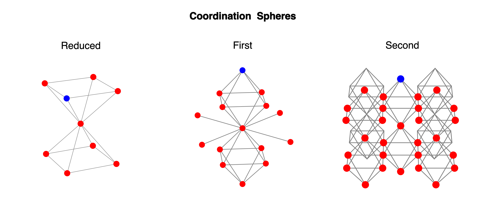

# Crystal Configuration Generator

## Overview

The **Crystal Configuration Generator** is a Python toolkit for enumerating and visualizing unique atomic configurations in lead-halide perovskite coordination spheres with variable Br/I (bromine/iodine) ratios. This information is useful for investigating the behavior of lead-based perovskite crystals, which are widely studied for their interesting photovoltaic properties.

You can use the generator both as a **command-line script** or a **Streamlit web app**.

Currently available geometries:



---

## Installation

### 1. Clone the Repository
```bash
git clone https://github.com/yourusername/crystal-config-generator.git
cd crystal-config-generator
```

### 2. Set up the Conda Environment

Install dependencies with:

```bash
conda env create -f environment.yml
conda activate crys_conf
```
## Usage

### Command-Line Script

To enumerate unique configurations for a chosen coordination sphere and Br content:

```bash
python scripts/get_configurations.py --sphere 1 --nbr 2 --save-svg
```
- `--sphere` Select the coordination sphere: 1 (first), 2 (second), 3 (reduced).
- `--nbr`  Number of Br atoms.
- `--save-svg` Save SVG images of all unique configurations (if not too many).
- See `python scripts/get_configurations.py --help` for all options

SVG images will be saved in a new folder if requested.


### Streamlit Web App

Interactive visualization and exploration:

```bash
cd streamlit_app
streamlit run CCG.py
```
You can select:
- The coordination sphere,

- The number of Br atoms,

- Whether to show axes,

- The maximum number of configurations to enumerate/visualize.

Note: For large cases, only statistics are shown (no plotting) to keep the interface responsive.

### Online Demo

Try the app instantly (no installation needed):

https://crystal-configuration-generator-cwrckzv5wx5hmrmxxxayz6.streamlit.app/

## Handling Large Configuration Spaces

When the number of possible atomic configurations becomes very large, the Crystal Configuration Generator automatically switches to a fast combinatorial method (Burnside’s lemma) to efficiently count unique configurations. In these cases, the program provides summary statistics only—including the total number of configurations and the number of unique configurations—without generating or visualizing individual structures. This ensures results are returned quickly and prevents memory or performance issues.

## License

CCG is licensed under the [GNU Affero General Public License Version 3](https://www.gnu.org/licenses/agpl-3.0.html). For more details, see the LICENSE file.